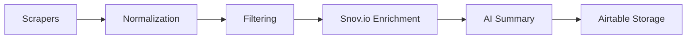
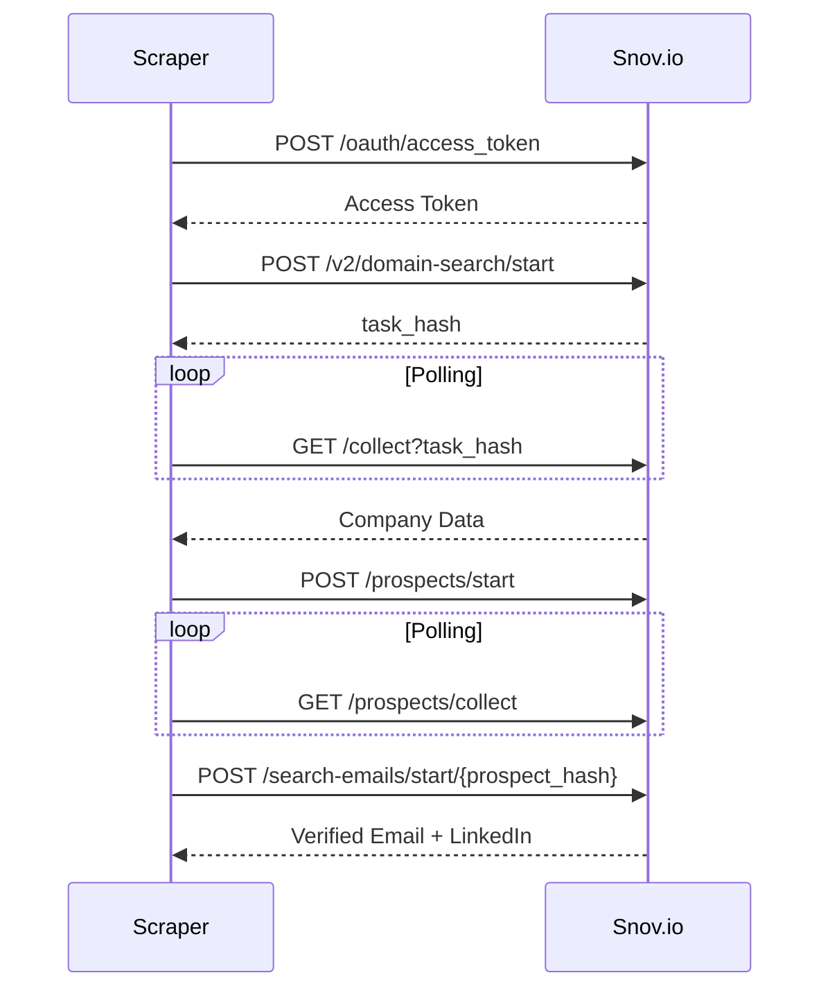

# Web3 Scrapers with Snov.io Enrichment: Execution Plan

## 🎯 Overview
Build custom scrapers for 7 Web3 data sources + Snov.io enrichment to deliver actionable leads with verified contact information. Focuses on cost-effective strategies using free APIs/web scraping.

## ⚙️ Overall Architecture


### 🔍 Key Components
1. **Data Collection**
   - Minimum fields: `project_name`, `website`, `token_sale_type`, `launchpad`, `status`, `category`, `launch_date`
   - Optional: `initial_cap`, `funds_raised`

2. **Normalization & Deduplication**
   - Extract domain from website as unique key
   - Merge duplicates: Keep earliest launch_date, aggregate categories
   - Example: `https://example.com` → `example.com`

3. **Filtering System**
   - Include: DeFi, AI, Gaming, Pre-token, Token Launch
   - Exclude: Memecoins, Points Farming, irrelevant categories
   - Implement at ingestion layer

4. **Snov.io Enrichment Flow**


5. **AI Analysis**
   - Optional LLM summarization
   - Generate: Lead Summary, Competitor Analysis
   - Use caching for free tier optimization

6. **Storage (Airtable)**
   ```markdown
   | Field              | Source               |
   |--------------------|----------------------|
   | Project Name       | Scraper              |
   | Domain             | Derived from website |
   | Email              | Snov.io enrichment   |
   | LinkedIn           | Snov.io enrichment   |
   | Lead Summary       | AI analysis          |
   | Competitor Analysis| AI analysis          |
   ```

## 🔎 Source-Specific Scraping Strategies

| Source         | Access Method                          | Key Fields                                      | Special Notes                                  |
|----------------|----------------------------------------|------------------------------------------------|------------------------------------------------|
| **CryptoRank** | Static HTML scraping                   | Name, Type, Launchpad, Funds, Date            | Follow detail pages for official sites         |
| **CoinMarketCap**| Free API (333 calls/day)              | Name, Symbol, Website, Social Links           | Fallback to headless scraping if blocked       |
| **DappRadar**  | Official API or web3earner.com         | Name, Website, Blockchain, Social Links       | Avoid direct scraping (Cloudflare)             |
| **ICODrops**   | Puppeteer/Playwright (dynamic content) | Name, Ticker, Category, Launch Date           | Exclude "Meme" & "Points Farming" categories   |
| **Zealy**      | Twitter search + web3earner.com        | Name, Website, Network, Category              | Focus on high-profile campaigns                |
| **DAO Maker**  | Twitter monitoring + coincarp.com     | Name, Ticker, Sale Date, Website              | White-list reputable launchpads                |
| **Polkastarter**| RSS feed + Twitter monitoring          | Name, Website, Sale Date                      | Login scraping as last resort                  |

## 🛠️ Snov.io Integration Details
### Authentication
```bash
POST https://api.snov.io/oauth/access_token
{
  "client_id": "YOUR_ID",
  "client_secret": "YOUR_SECRET"
}
```
- Token valid 1 hour
- Refresh on expiration

### Domain Search Workflow
1. Start search: `POST /v2/domain-search/start`
2. Collect results: `GET /v2/domain-search/collect?task_hash=...`
3. Start prospect search: `POST /v2/domain-search/prospects/start`
4. Find emails: `POST /v2/domain-search/prospects/search-emails/start/{prospect_hash}`
5. Collect emails: `GET /v2/domain-search/prospects/search-emails/collect/{task_hash}`

### Rate Management
- Free tier limits: 50 domain searches/day, 100 prospect searches/day
- Prioritize enrichment for filtered projects
- Manual fallback for failed enrichments

## ⚠️ Operational Considerations
1. **Scheduling**
   - Daily runs: 02:00 UTC
   - Weekly runs: 03:00 UTC (Monday)
   - Tools: node-cron with exponential backoff

2. **Error Handling**
   - Try/catch around HTTP calls
   - Timeout: 30s per request
   - Skip failed sources after 3 retries

3. **Compliance**
   - Respect robots.txt
   - 1-2s delay between requests
   - Cache responses to minimize calls
   - Honor API rate limits

4. **Testing**
   - Unit tests for parsers
   - Mock API responses
   - Sample HTML/JSON validation sets

## ✅ Success Metrics
- 80%+ enrichment success rate for filtered projects
- <5% duplicate records in Airtable
- Zero blocked scrapers (through rate limiting)
- Daily ingestion of 50-200 qualified leads
```


